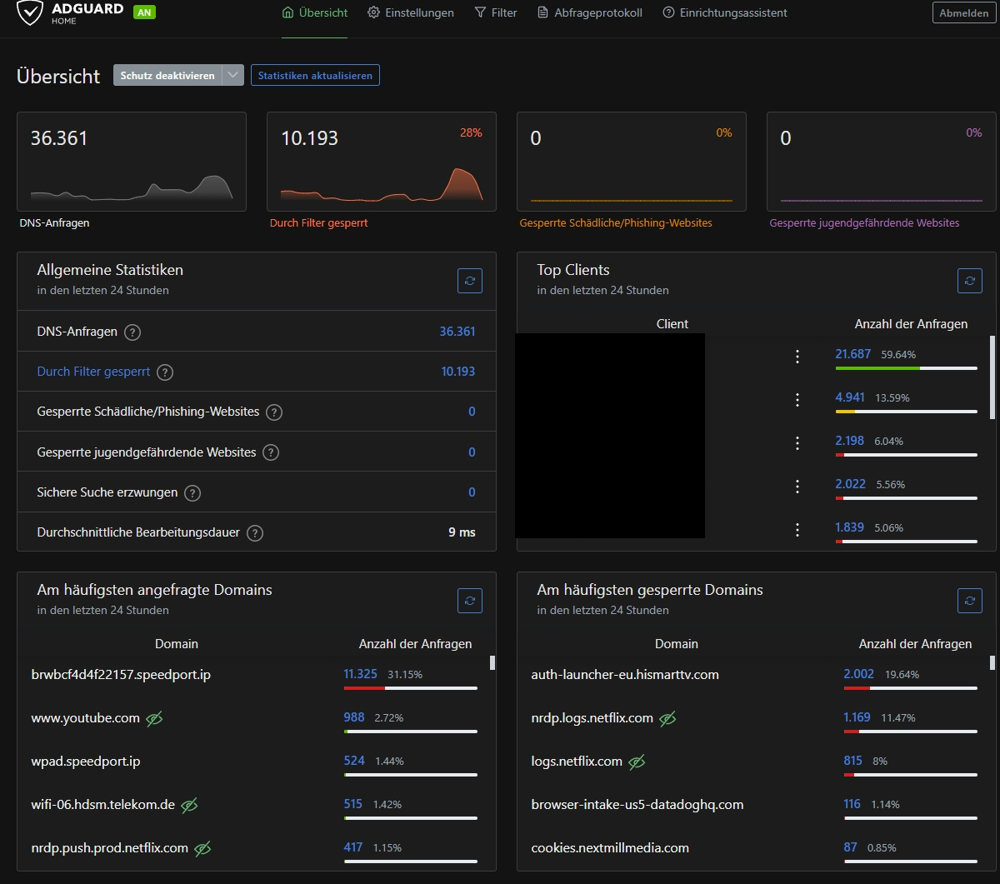

# AdGuard Home
Netzwerkweites DNS-Filtern für Werbung, Tracking und Sicherheitsbedrohungen in meinem Homelab.

## Über das Projekt
AdGuard Home läuft als eigener LXC-Container auf meinem Proxmox-Server und übernimmt sowohl die DNS-Filterung als auch die DHCP-Vergabe für mein gesamtes Heimnetzwerk.

## Was ich gemacht habe

### Filterlisten-Konfiguration
Ich habe bewusst zwischen zwei Kategorien unterschieden, statt wahllos Listen zu aktivieren:

**Werbung & Tracking:**
- AdGuard DNS filter
- AdAway Default Blocklist

**Sicherheit (Malware/Phishing):**
- Phishing URL Blocklist (PhishTank and OpenPhish)
- Dandelion Sprout's Anti-Malware List
- HaGeZi's Badware Hoster Blocklist
- HaGeZi's DNS Rebind Protection
- HaGeZi's DynDNS Blocklist
- HaGeZi's Encrypted DNS/VPN/TOR/Proxy Bypass
- HaGeZi's Threat Intelligence Feeds
- HaGeZi's The World's Most Abused TLDs
- Stalkerware Indicators List
- Malicious URL Blocklist (URLHaus)

### DHCP-Server
AdGuard Home übernimmt zusätzlich die komplette IP-Vergabe im Netzwerk (statt des Router-eigenen DHCP), inklusive fester IP-Zuweisungen für alle Geräte anhand ihrer MAC-Adresse — das macht das Netzwerk übersichtlich und jedes Gerät jederzeit eindeutig identifizierbar.

### Eigene Sperrregel (Custom Filtering Rules)
Zusätzlich zu den Filterlisten lassen sich eigene Regeln in AdBlock-Syntax definieren:

### Fallback-DNS für Ausfallsicherheit
Um nicht komplett abhängig von einer einzelnen DNS-Instanz zu sein, habe ich auf den Geräten zusätzlich einen sekundären DNS-Server (Quad9, 9.9.9.9) hinterlegt. Greift automatisch, falls AdGuard Home mal nicht erreichbar ist – bewusst unabhängig vom Provider-Router konfiguriert.

## Troubleshooting-Beispiel: Ressourcenengpass durch Filterlisten
Nach dem Hinzufügen weiterer Sicherheits-Filterlisten (insbesondere HaGeZi's Threat Intelligence Feeds mit über 2 Millionen Einträgen) fiel mir auf, dass AdGuard Home zeitweise komplett nicht mehr reagierte und dadurch das gesamte Netzwerk spürbar langsamer wurde.

**Diagnose:** Blick in die Proxmox-Ressourcenübersicht des Containers zeigte RAM- und Swap-Auslastung bei jeweils ca. 99 % – der LXC-Container war mit den ursprünglich zugewiesenen 512 MB RAM für die Menge an Filterlisten-Einträgen zu knapp bemessen.

**Ursache verstanden:** AdGuard Home lädt alle aktiven Filterlisten vollständig in den Arbeitsspeicher, um DNS-Anfragen schnell abgleichen zu können. Da AdGuard Home der zentrale DNS-Server für das gesamte Netzwerk ist, führte der Ausfall dazu, dass praktisch kein Gerät im Netz mehr Domainnamen auflösen konnte – ein anschauliches Beispiel dafür, wie ein einzelner Dienst zum Single Point of Failure werden kann.

**Lösung:** RAM-Zuteilung des Containers in Proxmox von 512 MB auf 1,46 GB erhöht. Danach sank die Auslastung sofort auf einen stabilen Bereich (RAM ca. 26 %, Swap unter 2 %).

## Was ich gelernt habe
- Funktionsweise von DNS-basierter Filterung und der Unterschied zwischen Werbe-/Tracking- und Sicherheitsfilterlisten
- Zusammenhang zwischen Filterlisten-Größe und Ressourcenverbrauch (RAM/Swap)
- DNS als zentraler Single Point of Failure in einem Netzwerk – Ausfall des DNS-Servers wirkt wie ein kompletter Internetausfall, obwohl die eigentliche Verbindung funktioniert
- Systematisches Troubleshooting: Symptom (Netzwerk langsam) → Ressourcenmonitoring → Ursache identifiziert → Konfiguration angepasst → Erfolg verifiziert
- Aufbau von Ausfallsicherheit durch Fallback-DNS-Konfiguration
- Grundlagen zu DNS über HTTPS (DoH) und wann eine Verschlüsselung innerhalb des eigenen LANs sinnvoll ist bzw. nicht

## Verwendete Technologien
- AdGuard Home
- Proxmox VE (LXC-Container)

## Teil des Homelab
- [Proxmox VE](https://github.com/Criison/Proxmox-VE)
- [Home Assistant](https://github.com/Criison/homelab-home-assistant)
- [Python3 LXC – Pingsweep-Script](https://github.com/Criison/homelab-python3)

## Screenshots

**Dashboard-Übersicht:**

